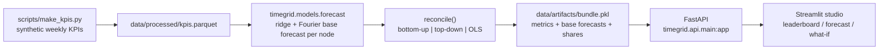
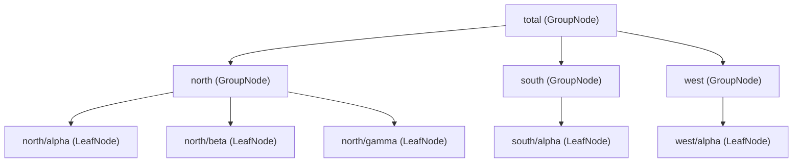

<div align="center">


</div>

# TimeGrid — Hierarchical KPI Forecasting with Coherent Reconciliation

**Forecast a business hierarchy so the numbers actually add up.** Independent per-series forecasts almost never sum correctly — the store forecasts don't total the region, the regions don't total the national number. TimeGrid models the whole hierarchy as one composite tree and reconciles the base forecasts (bottom-up, top-down, or OLS projection) so every level is mathematically consistent, then scores what each method costs or gains in accuracy.

<div align="center">

[](https://www.python.org/)
[](https://fastapi.tiangolo.com/)
[](https://pytest.org/)
[](https://opensource.org/licenses/MIT)

</div>

---

## The problem

A retailer forecasts demand at many nested levels at once: a national total that is the sum of regions, each region the sum of its product lines. If you fit a separate model per series — which is usually what gives the best fit at each level — the forecasts come out **incoherent**: the sum of the bottom-level forecasts does not equal the region forecast, which does not equal the total. Planning off incoherent numbers means different teams commit to figures that silently contradict each other.

TimeGrid fixes this. It keeps the accuracy of independent per-series models but **reconciles** their outputs against the hierarchy so the summing constraints hold exactly, and it reports how much accuracy each reconciliation method trades at each level so the choice is informed rather than assumed.

## What it does

- Builds a KPI hierarchy (total → regions → region×product bottom series) as a single composite tree.
- Fits an independent base forecast per node, then reconciles with **bottom-up**, **top-down**, or **OLS projection**.
- Serves a **leaderboard** comparing accuracy (MAPE per level) and coherence error across methods.
- Exposes a **what-if planner**: boost one bottom series and see the coherent knock-on effect propagate up its region and the total.

## How it works

The hierarchy is modelled directly as a tree — the tree *is* the object graph. Every operation (aggregating, allocating by share, checking coherence, building the summing matrix) is a recursion over that tree, so there is no separate "hierarchy table" to keep in sync with the data.



### The composite tree

Two node types share one interface, so callers never branch on "is this a region or a product?" — they call the same method on whatever node they hold and the recursion terminates itself at the leaves.



- `LeafNode` — a bottom series that owns observed values and derives nothing.
- `GroupNode` — a series *defined* as the sum of its children (the total, or one region).

The three reconciliation moves map exactly onto three tree traversals:

| Method | Traversal | Idea |
|---|---|---|
| `bottom_up` | post-order `fold()` | believe the leaves, sum upward |
| `top_down` | pre-order `distribute()` | believe the root, split down by historical share |
| `ols` | projection via the summing matrix | project base forecasts onto the coherent subspace |

## Methodology

### Base forecasts

Each node is fit **independently** with ridge regression in log space on a small feature set — linear trend plus annual and semi-annual Fourier terms (`sin`/`cos` at 52- and 26-week periods). The log transform makes the base forecasts genuinely multiplicative, and therefore genuinely incoherent: a purely additive linear fit would already satisfy the summing constraints and leave reconciliation nothing to do.

### Summing matrix and reconciliation

Let $\mathbf{y}_t \in \mathbb{R}^m$ be the vector of all $m$ series and $\mathbf{b}_t \in \mathbb{R}^n$ the $n$ bottom-level (leaf) series. The structural summing matrix $\mathbf{S} \in \{0,1\}^{m \times n}$ — read straight off the tree by walking each node's descendant leaves — encodes the constraints:

$$\mathbf{y}_t = \mathbf{S}\,\mathbf{b}_t$$

Given incoherent base forecasts $\hat{\mathbf{y}}_h$, the OLS-projection method returns the coherent forecast closest to the base forecasts in Euclidean distance:

$$\tilde{\mathbf{y}}_h = \mathbf{S}\left(\mathbf{S}^\top \mathbf{S}\right)^{-1}\mathbf{S}^\top \hat{\mathbf{y}}_h$$

This is the ordinary-least-squares (identity-weight) case of the general MinT family; TimeGrid implements the OLS variant. Bottom-up and top-down are the two classic non-projection reconcilers, kept for comparison on the leaderboard.

### Coherence as a testable invariant

Coherence error is the worst absolute violation of "a group equals the sum of its children" anywhere in the tree. It is computed as a recursion over the composite and is exactly zero (to numerical tolerance) for any reconciled forecast — which the test suite asserts.

## Getting started

```bash
make install                 # uv sync --group dev

# generate synthetic data and fit + backtest the models (writes data/artifacts/bundle.pkl)
uv run python scripts/make_kpis.py
uv run python -m timegrid.models.forecast

make api                     # FastAPI on http://localhost:8450
make ui                      # Streamlit studio on http://localhost:8951
```

The API loads `data/artifacts/bundle.pkl`; run the two data/model commands above first, or every endpoint that needs artifacts returns `503`. Model runs log metrics to MLflow — browse them with `make mlflow` (http://localhost:5046).

Or with Docker:

```bash
make docker-up               # docker compose up --build -d  (api on 8450, ui on 8951)
make docker-down
```

## API

| Method | Route | Purpose |
|---|---|---|
| `GET` | `/health` | Liveness check |
| `GET` | `/hierarchy` | The tree: total, regions, and bottom series names |
| `GET` | `/leaderboard` | Backtest metrics (MAPE per level + coherence error) for every method |
| `GET` | `/forecast?method=ols` | Coherent forecast per node (`base`, `bottom_up`, `top_down`, `ols`) with its coherence error |
| `POST` | `/whatif` | Boost one bottom series and propagate the coherent impact up its ancestors |

Illustrative `/forecast` response shape (synthetic data — not a benchmark):

```json
{
  "method": "ols",
  "weeks": [157, 158, "..."],
  "coherence_error": 0.0,
  "forecasts": { "total": ["..."], "north": ["..."], "north/alpha": ["..."] }
}
```

## Evaluation

Evaluation is a **rolling-origin backtest** on synthetic weekly KPIs with a known additive hierarchy, so coherence has a ground-truth definition to test against. `timegrid.models.forecast` holds out the final 24 weeks, fits base models on the rest, and for each reconciliation method reports:

- **MAPE at each level** — total, region, and bottom — so accuracy trade-offs between methods are visible per level.
- **Coherence error** — the worst summing-constraint violation, expected to collapse to ~0 after any reconciliation.

Metrics are logged to MLflow and served by `/leaderboard`. Concrete numbers are intentionally omitted here — they depend on the generated dataset and random seed. Reproduce them for your configuration with:

```bash
uv run python scripts/make_kpis.py
uv run python -m timegrid.models.forecast   # prints and logs the metrics
```

## Testing

```bash
make test                    # uv run pytest --cov
```

`tests/test_timegrid.py` covers the composite (uniform interface, traversal orders, fold/distribute/coherence invariants), the summing matrix (including irregular tree shapes and mixed leaf depths), reconciliation (OLS idempotence on coherent input, coherence restoration, an honest leaderboard), and the HTTP contract for `/hierarchy`, `/forecast`, and `/whatif`.

## Limitations

- All data is synthetic (`scripts/make_kpis.py`); parameters and model choices are tuned for the demo, not real demand distributions.
- Base models are deliberately simple (ridge on trend + Fourier features) — no exogenous regressors, holidays, or probabilistic intervals.
- Reconciliation implements the OLS-projection case, not the full covariance-weighted MinT with an estimated error covariance $\mathbf{W}$.
- The bundled hierarchy is two levels deep (region × product); the code handles arbitrary tree shapes, but only the two-level factory is wired to the config.

## Project structure

```
src/timegrid/
├── hierarchy/          # the core: composite tree + reconciliation
│   ├── node.py         # Node (ABC), LeafNode, GroupNode + tree recursions
│   ├── summing.py      # summing matrix S, derived by walking the tree
│   ├── reconcile.py    # bottom_up, top_down, ols, reconcile()
│   └── factory.py      # build the total → region → product tree from config
├── models/forecast.py  # ridge + Fourier base forecasts and the backtest
├── api/                # FastAPI app (main:app) and routes
├── ui/app.py           # Streamlit studio (leaderboard / forecast / what-if)
└── settings.py         # config + environment loading
scripts/make_kpis.py    # synthetic KPI generator
configs/config.yaml     # hierarchy, horizon, holdout, ridge alpha
```

## License

MIT

---

<div align="center">

**Jackson Marcus** · Senior AI & Machine Learning Engineer

[](https://github.com/jackson-marcus)
[](mailto:wajahatanees41@gmail.com)

</div>
