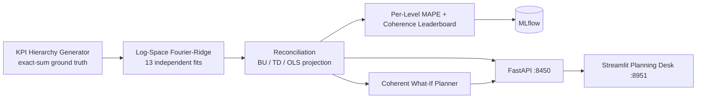

# TimeGrid — Hierarchical KPI Forecasting & Reconciliation Engine

<div align="center">

[](https://www.python.org/)
[](https://fastapi.tiangolo.com/)
[](https://streamlit.io/)
[](https://mlflow.org/)
[](https://www.docker.com/)
[](https://github.com/astral-sh/ruff)
[](https://pytest.org/)
[](https://opensource.org/licenses/MIT)

</div>

> **Forecasts that add up: per-series log-space Fourier-ridge base models over a total → region → product hierarchy, reconciled by bottom-up, top-down, and OLS projection — with a leaderboard that prices each method per level and a coherent what-if planner.**

---

## 📖 Executive Summary & Value Proposition

**`timegrid`** is a production-grade, end-to-end machine learning system built with strict engineering discipline, reproducible pipelines, and enterprise MLOps best practices. It bridges the gap between theoretical statistical rigor and high-availability operational microservices.

## 🗓️ Core Methodologies & Hierarchical Forecasting

### 1. Why Base Forecasts Disagree With Themselves
- 13 series (1 total, 3 regions, 9 region×product) each get an independent **log-space** ridge fit on trend + Fourier terms. The log transform models multiplicative seasonality — and it's precisely what makes base forecasts incoherent (a purely linear fit would be additive and reconciliation would have nothing to fix; the code says so). Base coherence violation: **27.8 units**.

### 2. Three Reconciliation Methods, Priced Per Level
Rolling-origin holdout (24 weeks), MAPE by hierarchy level:

| Method | Total | Region | Bottom | Coherence |
|---|---|---|---|---|
| Base (independent) | 2.99% | 4.26% | 5.56% | ✗ 27.8 |
| **Bottom-up** | **2.92%** | **4.14%** | 5.56% | ✓ 0 |
| Top-down (shares) | 2.99% | 5.34% | **9.74%** | ✓ 0 |
| OLS projection | 2.96% | 4.29% | 5.69% | ✓ 0 |

The textbook results, reproduced: every method restores exact coherence; bottom-up wins here; **top-down destroys bottom-level accuracy** (static shares can't track series-specific trends).

### 3. Coherent What-If Planner
- Boost any bottom series (e.g., north/alpha +10% for 8 weeks): the scenario propagates bottom-up so region and total move by **exactly** the same delta — baseline and scenario use the same reconciliation, so the delta measures the intervention, not method differences.

## 📊 Architecture & Pipeline



## 🛠️ Tech Stack & Engineering Standards
- **Core Engine:** Python 3.12, NumPy, scikit-learn, Pandas — hand-rolled summing matrix and projections
- **Serving & UI:** FastAPI, Streamlit + Plotly drilldowns, MLflow
- **Testing:** Pytest verification of generator coherence, projection idempotence on already-coherent input, incoherence-then-restoration, leaderboard orderings, and what-if delta exactness


---

## 🚀 Quickstart & Setup Guide

### 1. Prerequisites & Environment Setup
Using **[uv](https://docs.astral.sh/uv/)** for lightning-fast, reproducible dependency resolution:

```bash
# Clone the repository
git clone https://github.com/jackson-marcus/timegrid.git
cd timegrid

# Install dependencies and pre-commit hooks
uv sync --group dev
```

### 2. Generate the Hierarchy & Backtest
```bash
# Synthesize 156 weeks of coherent hierarchical KPIs
uv run python scripts/make_kpis.py

# Base fits + all reconciliation methods on a rolling holdout; logs to MLflow
uv run python -m timegrid.models.forecast
```

### 3. Run Test Suite & Code Quality Checks
```bash
# Run unit & integration tests with coverage
uv run pytest --cov

# Run ruff linter and formatting checks
uv run ruff check .
uv run ruff format --check .
```

### 4. Launch Services Locally
```bash
# Start FastAPI REST API (listening on port :8450)
make api
# Or: uv run uvicorn timegrid.api.main:app --reload --port 8450

# Start interactive Streamlit dashboard (listening on port :8951)
make ui

# Launch local MLflow Experiment Tracking UI (listening on port :5046)
make mlflow
```

### 5. Run with Docker Compose
```bash
# Spin up the complete microservice stack
docker compose up --build
```

---

## 📂 Repository Layout

```
timegrid/
├── .github/workflows/ci.yml       # GitHub Actions CI pipeline (lint, test, build)
├── configs/                      # Hierarchy, forecast, and holdout configuration
├── data/                         # Generated KPIs + forecast bundle artifacts
├── scripts/                      # make_kpis.py exact-sum hierarchy generator
├── src/timegrid/                 # Core Python package
│   ├── api/                      # FastAPI routes: /leaderboard /forecast /whatif /hierarchy
│   ├── models/                   # Base forecasts + summing matrix + reconciliation
│   ├── ui/                       # Streamlit planning desk application
│   └── settings.py               # Centralized configuration & environment loader
├── tests/                        # Comprehensive Pytest suite
├── docker-compose.yml            # Multi-service container orchestration
├── Dockerfile                    # Container definition for API service
├── Makefile                      # Standardized project tasks
└── pyproject.toml                # Pinned dependencies and tool configs
```

---

## 👤 Author & Contact

**Jackson Marcus**
- **Email:** [jackson.marcus.work@gmail.com](mailto:jackson.marcus.work@gmail.com)
- **Upwork:** [Jackson Marcus on Upwork](https://www.upwork.com/freelancers/~012235717501ad9c7b)
- **GitHub:** [@jackson-marcus](https://github.com/jackson-marcus)

*Available for machine learning engineering, MLOps, data science, and AI system architecture consulting and contract engagements.*
